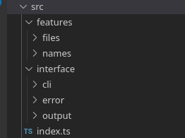

# Code Challenge #1242

The current project consist in a program that process a file with people's names and generate an output file with statistics.

- [Code Challenge #1242](#code-challenge-1242)
  - [Technologies](#technologies)
  - [Features](#features)
  - [How to install](#how-to-install)
  - [Run the project](#run-the-project)
      - [For development purposes:](#for-development-purposes)
      - [Ran the compiled program](#ran-the-compiled-program)
  - [File structure](#file-structure)

## Technologies
- [Typescript 4](https://www.typescriptlang.org/docs/handbook/release-notes/typescript-4-0.html)
- [JavaScript ES6](https://www.w3schools.com/js/js_es6.asp)
- [NodeJS 16](https://nodejs.org/en/blog/release/v16.16.0/)

## Features
- [TypeScript compiler](https://www.typescriptlang.org/docs/handbook/compiler-options.html)
- [Reading files with FileSystem](https://nodejs.org/api/fs.html)
- [Go through file's lines with ReadLine](https://nodejs.org/api/readline.html)

## How to install

| Step | Action                          | Command         |
| ---- | ------------------------------- | --------------- |
| 1    | Download the project            | ----            |
| 2    | Install dependencies            | `npm i`         |
| 3    | Ran the project for development | `npm run dev`   |
| 4    | Build the project               | `npm run build` |

That's all!.

The last command will run the project with the `input.txt` file, but you can also run the project with a custom input 
file or request a custom number of names in the modified list generated:

## Run the project

There are several ways to ran the project depending of what you want to do:

#### For development purposes:

| Method | Action                                                        | Command                                                 |
| ------ | ------------------------------------------------------------- | ------------------------------------------------------- |
| 1      | Run the project with the default input file                   | `npm run dev`                                           |
| 2      | Run the project with a custom input file                      | `ts-node src/index.ts [custom_input_path]`              |
| 3      | Change the limit of names generated at the end of the program | `ts-node src/index.ts input.txt [N-of-names]`           |
| 4      | Ran the project with a custom input file and a custom N       | `ts-node src/index.ts [custom_input_path] [N-of-names]` |

#### Ran the compiled program

Follow [these steps](#run-the-project) to compile the program.

Once you have the program compiled, then you could run the output file using node or ts-node, please check this examples:

1. I'm in the project root folder and will compile the program: `npm run build`
2. A file is generated in the path `bin/index.js`
3. I will to run that file: `node bin/index.js input.txt 40`

## File structure

|                                            |                                                                                                                                                                                                                                                                                                                                                                                                                                                                                                                                                                                                                                                                                                                                                          |
| ------------------------------------------ | -------------------------------------------------------------------------------------------------------------------------------------------------------------------------------------------------------------------------------------------------------------------------------------------------------------------------------------------------------------------------------------------------------------------------------------------------------------------------------------------------------------------------------------------------------------------------------------------------------------------------------------------------------------------------------------------------------------------------------------------------------- |
|  | **src:** In source folder are all the logic of the program, here's where you can change or add new functionalities. In the `src/index.ts` you'll find the main logic of the APP **features:** In this folder you'll find the business logic of the program.  <ul><li>**files:** Here's the logic to handle files: Read files, lines or write a new file.</li> <li>**names:** In this folder you'll find the logic to handle the names and create the statistics.</li></ul>**interface:** Here's the logic related to the different interfaces of the program, currently we've just a CLI interface, which is creating two new interfaces which are the output (how the output looks) and the errors (how the errors are shown to the user).  |
